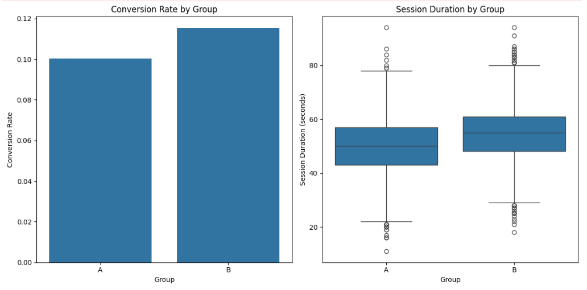

# A | B Testing

## A/B Testing for Improving User Engagement at **TechSavvy Inc.**

### Introduction

In today's competitive e-commerce landscape, user engagement is crucial for driving sales and customer loyalty. **TechSavvy Inc.**, a fictional online retailer of tech gadgets, noticed a decline in user engagement on their product pages. The company wanted to explore whether changing the **"Add to Cart"** button color from blue to green would increase user engagement and conversions.

I, Kevin, an experienced AWS Certified Solutions Architect and Data Analyst, was brought in to tackle this problem. Leveraging my expertise in A/B testing, data analysis, and business intelligence, I devised a comprehensive plan to address TechSavvy Inc.'s challenge.


### Understanding the Problem

**TechSavvy Inc.** had observed that users were spending less time on product pages and that the click-through rate for the "Add to Cart" button had decreased. The goal was to test a hypothesis: would a green "Add to Cart" button capture more user attention and encourage more clicks compared to the existing blue button?

**Objective**: Increase user engagement and conversion rates by optimizing the "Add to Cart" button color.

---
>### Definitions
>
>1. **A/B Testing**: A method of comparing two versions of a webpage or app against each other to determine which one performs better.
>
>2. **Control Group (Group A)**: The group that experiences the original version of the product or feature.
>
>3. **Treatment Group (Group B)**: The group that experiences the modified version of the product or feature.
>
>4. **Conversion Rate**: The percentage of users who complete a desired action (e.g., clicking the "Add to Cart" button).
>
>5. **T-Test**: A statistical test used to determine if there are significant differences between the means of two groups.
>
>6. **Chi-Square Test**: A statistical test used to determine if there is a significant association between two categorical variables.
>
>7. **P-Value**: The probability that the observed results are due to chance. A low p-value (typically < 0.05) indicates that the results are statistically significant.
>
>8. **Null Hypothesis**: The hypothesis that there is no effect or difference. In A/B testing, it assumes that any observed difference between the control and treatment groups is due to random chance.
>
>9. **Alternative Hypothesis**: The hypothesis that there is an effect or difference. In A/B testing, it assumes that any observed difference between the control and treatment groups is due to the change being tested.

---

## Step-by-Step Solution

> To follow along, the Juypiter Notebook, data-generation script and dataset can be found in this [directory.](https://github.com/kevinndungu-source/A-B_Testing/tree/main/Code)
>

### 1. **Define Hypothesis**

I proposed the following hypothesis:
- **Null Hypothesis (H0)**: Changing the button color has no effect on user engagement.
- **Alternative Hypothesis (H1)**: Changing the button color increases user engagement.


---

### 2. **Design the Experiment**

I designed an A/B test to compare two versions of the product page:
- **Version A (Control)**: Product page with a blue "Add to Cart" button.
- **Version B (Treatment)**: Product page with a green "Add to Cart" button.

Users would be randomly assigned to one of the two versions to ensure unbiased results.


---

### 3. **Simulate Data Collection**

To prepare for the experiment, I simulated a dataset representing user interactions. The dataset included:
- `user_id`: Unique identifier for each user.
- `group`: Indicates whether the user is in the control group (A) or the treatment group (B).
- `timestamp`: The time when the user visited the product page.
- `clicked_add_to_cart`: A binary variable indicating whether the user clicked the "Add to Cart" button.
- `session_duration`: Duration of the user's session on the product page in seconds.

The code block below generates the synthetic dataset for our simulation:

```python
# Running this script will generate the dataset and save it as techsavvy_ab_test_data.csv in the current working directory.

# Import the necessary libraries.

import pandas as pd
import numpy as np

# Set the random seed for reproducibility
np.random.seed(42)

# Number of users
n_users = 10000

# Simulate the data
data = {
    'user_id': range(1, n_users + 1),
    'group': np.random.choice(['A', 'B'], n_users),
    'timestamp': pd.date_range(start='2024-07-01', periods=n_users, freq='T'),
    'clicked_add_to_cart': np.random.binomial(1, 0.1, n_users),
    'session_duration': np.random.normal(50, 10, n_users).astype(int)
}

# Adjust probabilities for treatment group (B)
treatment_mask = (data['group'] == 'B')
data['clicked_add_to_cart'][treatment_mask] = np.random.binomial(1, 0.12, treatment_mask.sum())
data['session_duration'][treatment_mask] += 5

# Create a DataFrame
df = pd.DataFrame(data)

# Save the DataFrame to a CSV file
df.to_csv('techsavvy_ab_test_data.csv', index=False)
```

---


### 4. **Analyze the Results**

I calculated the conversion rates and performed statistical tests to compare the engagement rates between the two groups as shown by the code blocks at each stage.


```python
# Calculating Conversion Rates.

# A/B Testing: Comparing two versions of a webpage to determine which one performs better.
# Group A: Control group with the original version.
# Group B: Treatment group with the modified version.


# Conversion Rate: The percentage of users who click the "Add to Cart" button

conversion_A = df[df['group'] == 'A']['clicked_add_to_cart'].mean()
conversion_B = df[df['group'] == 'B']['clicked_add_to_cart'].mean()

print(f"Conversion Rate A: {conversion_A:.2f}")
print(f"Conversion Rate B: {conversion_B:.2f}")
#### EXPLANATION OF THE OUTPUT

The output you've received shows the conversion rates for both the control group (Group A) and the treatment group (Group B):

- **Conversion Rate A:** 0.10 (or 10%)

- **Conversion Rate B:** 0.12 (or 12%)
```


#### EXPLANATION OF THE CONVERSION RATE RESULTS:

>1\. **Conversion Rate A (10%):**
>
>  - This is the conversion rate for the control group, which represents the users who experienced the original version of the webpage or feature. Out of all users in this group, 10% >clicked the "Add to Cart" button.
>
>2\. **Conversion Rate B (12%):**
>
>   - This is the conversion rate for the treatment group, which represents the users who experienced the modified version of the webpage or feature. In this group, 12% of users clicked >the "Add to Cart" button.

#### Interpretation & Value to Tech-Savvy:

>The A/B test reveals that the conversion rate in the treatment group (12%) is slightly higher than in the control group (10%). This suggests that the changes made to the webpage or >feature in the treatment group had a positive effect, leading to a higher percentage of users taking the desired action (clicking "Add to Cart").
>
#### Value to the Tech-Savvy Company:

>1\. **Improved User Engagement:**
>
>   - The higher conversion rate in Group B indicates that the modified version is more effective at engaging users. This insight can guide the company to implement these changes across >their platform, potentially leading to increased sales.
>
>2\. **Data-Driven Decision Making:**
>
>   - The results of this A/B test provide a solid, data-backed foundation for making decisions. Instead of relying on intuition, Tech-Savvy can confidently move forward with the changes >that have been statistically shown to improve user behavior.
>
>3\. **Optimization and Iteration:**
>
>   - Even though the improvement is moderate (from 10% to 12%), it demonstrates the value of continuous testing and optimization. Tech-Savvy can use this approach regularly to >incrementally improve their user interface and user experience, leading to better business outcomes over time.
>
>4\. **Understanding User Preferences:**
>
>   - This test gives the company insights into what resonates better with their users. Understanding the specific changes that led to the increase can help in crafting future features or >marketing strategies that align more closely with user preferences.
>
In summary, this A/B test has shown that the modifications introduced in Group B led to a measurable improvement in conversion rates, which can translate directly into increased revenue for the company. These results are crucial for making informed, strategic decisions to enhance the company's offerings and user satisfaction.

---

#### STATISTICAL T-TEST AND P-VALUE TESTS

Below is the Python code used to perform t-stat and p-values statistical tests:

```python
# 2. Perform Statistical Tests.

# T-Test: A statistical test to determine if there are significant differences between the means of two groups.
# Null Hypothesis: There is no difference in conversion rates between Group A and Group B.
# Alternative Hypothesis: There is a difference in conversion rates between Group A and Group B.

# Perform t-test
t_stat, p_value_ttest = stats.ttest_ind(
    df[df['group'] == 'A']['clicked_add_to_cart'],
    df[df['group'] == 'B']['clicked_add_to_cart']
)

print(f"T-Statistic: {t_stat:.2f}")
print(f"P-Value (t-test): {p_value_ttest:.4f}")
```


#### T-STATISTIC AND P-VALUE RESULTS EXPLANATION

The output from the t-test analysis is as follows:
>
>- **T-Statistic:** -2.41
>
>- **P-Value (t-test):** 0.0159
>

#### Explanation of the Results:

>1\. **T-Statistic (-2.41):**
>
>   - The t-statistic is a measure of the difference between the means of the two groups (Group A and Group B) relative to the variation in the data. In this case, a negative t-statistic >indicates that the mean conversion rate of Group A is lower than that of Group B. The magnitude of the t-statistic suggests how large the difference is in standard error units. A t->statistic of -2.41 means that the observed difference is 2.41 times the standard error.
>
>2\. **P-Value (0.0159):**
>
>   - The p-value represents the probability of observing the data, or something more extreme, assuming that the null hypothesis is true. The null hypothesis in this case posits that >there is no difference in conversion rates between Group A and Group B.
>
>   - A p-value of 0.0159 indicates that there is only a 1.59% chance that the observed difference (or a more extreme one) could have occurred under the assumption that there is no real >difference between the groups. Typically, a p-value less than 0.05 is considered statistically significant, meaning that the observed difference is unlikely to be due to random chance.

#### Interpretation & Value to Tech-Savvy:

>1\. **Rejecting the Null Hypothesis:**
>
>   - Since the p-value (0.0159) is less than the commonly used threshold of 0.05, we reject the null hypothesis. This means there is statistically significant evidence to suggest that the conversion rates between Group A (the control group) and Group B (the treatment group) are indeed different.
>
>2\. **Implication of the T-Statistic:**
>
>   - The negative t-statistic indicates that Group B's conversion rate is higher than Group A's. This supports the conclusion that the changes made in Group B had a positive impact, leading to a higher conversion rate compared to the control group.
>
#### Value to the Tech-Savvy Company:

>1\. **Data-Driven Validation:**
>
>   - The t-test results provide statistical validation that the changes implemented in Group B (the treatment group) are effective. This isn't just a random fluctuation but a significant improvement in conversion rates. This validation helps the company make confident decisions about implementing these changes on a broader scale.
>
>2\. **Business Impact:**
>
>   - By identifying and validating improvements that increase conversion rates, the company can potentially increase revenue. Even small percentage increases in conversion rates can lead to substantial financial gains, especially at scale.
>
>3\. **Informed Strategy:**
>
>   - The company can use this evidence to guide future strategies and A/B tests. Understanding what works allows Tech-Savvy to continually optimize their user experience, leading to better customer satisfaction and competitive advantage.
>
>In summary, the t-test results strongly suggest that the changes made in the treatment group (Group B) are effective in improving user conversion rates. This insight is valuable for making informed, data-driven decisions that can positively impact the company's bottom line.
>
---

#### Chi-SQUARE TEST

Below is the Python code block used to perform chi-square statistic and p-values statistical tests:
```python
# Perform chi-square test

# Chi-Square Test: A statistical test to determine if there is a significant association between two categorical variables.
# Null Hypothesis: There is no association between the group and the clicked "Add to Cart" button.
# Alternative Hypothesis: There is an association between the group and the clicked "Add to Cart" button.

contingency_table = pd.crosstab(df['group'], df['clicked_add_to_cart'])
chi2_stat, p_value_chi2, _, _ = stats.chi2_contingency(contingency_table)

print(f"Chi-Square Statistic: {chi2_stat:.2f}")
print(f"P-Value (chi-square): {p_value_chi2:.4f}")
```

#### Chi-TEST RESULTS EXPLANATION

The output from the Chi-Square test is as follows:
>
>- **Chi-Square Statistic:** 5.66
>
>- **P-Value (chi-square):** 0.0173
>
#### Explanation of the Results:

>1\. **Chi-Square Statistic (5.66):**
>
>   - The Chi-Square statistic is a measure of how much the observed frequencies in your contingency table deviate from the expected frequencies under the null hypothesis (which assumes >no association between the group and the "Add to Cart" action). A higher Chi-Square statistic suggests a greater discrepancy between observed and expected frequencies, indicating a >stronger association.
>
>2\. **P-Value (0.0173):**
>
>   - The p-value represents the probability of observing the data, or something more extreme, assuming that the null hypothesis is true. The null hypothesis here posits that there is no >association between the group (A or B) and whether users clicked the "Add to Cart" button.
>
>   - A p-value of 0.0173 indicates that there is only a 1.73% chance that the observed association (or a more extreme one) could have occurred by random chance. Since this p-value is less than the typical significance level of 0.05, the result is considered statistically significant.
>
#### Interpretation & Value to Tech-Savvy:

>1\. **Rejecting the Null Hypothesis:**
>
>   - Since the p-value (0.0173) is less than the 0.05 threshold, we reject the null hypothesis. This means there is statistically significant evidence to suggest an association between the group (A or B) and the likelihood of clicking the "Add to Cart" button. In other words, the version of the webpage or feature that the users were exposed to (Group A or Group B) had a significant impact on their behavior.
>
>2\. **Implication of the Chi-Square Statistic:**
>
>   - The Chi-Square statistic of 5.66 indicates that the observed differences between the groups are unlikely to be due to random variation alone. This suggests that the changes made to Group B's experience (the treatment group) positively influenced user behavior compared to Group A (the control group).
>
#### Value to the Tech-Savvy Company:

>1\. **Understanding User Behavior:**
>
>   - The significant association identified by the Chi-Square test confirms that the variations between the control and treatment groups have a meaningful impact on user actions. This insight can help Tech-Savvy better understand what aspects of their webpage or feature are driving user engagement, particularly with respect to crucial actions like adding items to the cart.
>
>2\. **Targeted Improvements:**
>
>   - With evidence of a significant association between the changes made in Group B and an increase in conversions, Tech-Savvy can focus on refining these changes further. The company can explore what specific elements (e.g., design, messaging, layout) were most influential and apply similar principles to other parts of the user experience.
>
>3\. **Strategic Decision-Making:**
>
>   - By validating the impact of their changes through statistical tests, Tech-Savvy can make more informed decisions about where to allocate resources. This helps in optimizing the user >interface or experience in a way that is backed by data, leading to more effective and profitable outcomes.
>
>4\. **Enhanced User Experience:**
>
>   - The results can be used to enhance the overall user experience by implementing changes that have been statistically proven to work. This not only boosts conversion rates but also contributes to a better customer journey, potentially increasing customer satisfaction and loyalty.
>
In summary, the Chi-Square test results provide strong evidence that the changes introduced in the treatment group (Group B) have a significant positive impact on user behavior. This is valuable for Tech-Savvy as it supports data-driven decisions to optimize their offerings and improve key performance indicators like conversion rates.

---


### 5. **Visualize the Findings**

I created visualizations to illustrate the differences in conversion rates and session durations between the two groups.

Below is the code block used:
```python
# Visualize the Findings.

# Visualization
plt.figure(figsize=(12, 6))

# Bar plot of conversion rates by group.
# Conversion Rate: The percentage of users who click the "Add to Cart" button.

# Conversion rates
plt.subplot(1, 2, 1)
sns.barplot(x='group', y='clicked_add_to_cart', data=df, ci=None)
plt.title('Conversion Rate by Group')
plt.xlabel('Group')
plt.ylabel('Conversion Rate')

# Box plot of session durations by group.
# Session Duration: The length of time a user spends on the product page.

# Session durations
plt.subplot(1, 2, 2)
sns.boxplot(x='group', y='session_duration', data=df)
plt.title('Session Duration by Group')
plt.xlabel('Group')
plt.ylabel('Session Duration (seconds)')

plt.tight_layout()
plt.show()
```


#### EXPLANATION OF THE GENERATED FIGURES

[](https://github.com/kevinndungu-source/A-B_Testing/blob/main/Code/Data_Analysis.ipynb)

The figure above consists of two key visualizations:

1\. **Conversion Rate by Group (Bar Plot):**

>   - **What It Shows:**
>
>     - This bar plot illustrates the conversion rates (the percentage of users who clicked the "Add to Cart" button) for the control group (Group A) and the treatment group (Group B).
>
>   - **Key Observations:**
>
>     - Group A (Control Group) has a conversion rate of approximately 10%.
>
>     - Group B (Treatment Group) has a slightly higher conversion rate of around 12%.
>
>   - **Implications for Tech-Savvy:**
>
>     - The increase in conversion rate from Group A to Group B suggests that the changes introduced in the treatment group had a positive impact on user behavior, leading to a higher percentage of users taking the desired action (clicking "Add to Cart").
>
>     - This insight is valuable as it indicates that the modifications in Group B are more effective at driving conversions, and similar strategies could be applied to other areas to further enhance user engagement and sales.
>

2\. **Session Duration by Group (Box Plot):**
>
>   - **What It Shows:**
>
>     - The box plot compares the distribution of session durations (the length of time users spend on the product page) between Group A and Group B.
>
>     - The plot includes median values, interquartile ranges, and outliers.
>
>   - **Key Observations:**
>
>     - Both groups exhibit similar session durations, with median times around 50-55 seconds.
>
>     - The interquartile range (IQR) is comparable for both groups, indicating that most users in both groups spend a similar amount of time on the product page.
>
>     - A few outliers (longer session durations) are observed in both groups.
>
>   - **Implications for Tech-Savvy:**
>
>     - The similar session durations between the two groups suggest that while the changes in Group B improved the conversion rate, they did not significantly affect the time users spent on the product page.
>
>     - This could imply that the changes made in Group B were more effective in guiding users toward making a decision (adding to cart) without needing them to spend more time on the page.
>
>     - For Tech-Savvy, this is a positive outcome, as it indicates that the modifications in Group B were efficient in improving user decisions without requiring additional engagement time, which can be crucial for optimizing the user experience.
>

#### Overall Value to Tech-Savvy:

>- **Conversion Rate Insights:**
>
>  - The increase in conversion rate in Group B is a strong indicator that the changes made are effective. Tech-Savvy can leverage this insight to further optimize their product pages and >apply similar strategies across other segments or product lines.
>
>- **Session Duration Insights:**
>
>  - The consistent session durations across both groups, despite the higher conversion rate in Group B, suggest that the changes were both effective and efficient. This balance is >crucial for maintaining a user-friendly experience while driving conversions.

In summary, the visualizations highlight the positive impact of the changes introduced in Group B, offering actionable insights for Tech-Savvy to improve their overall conversion strategy and user experience.

---


### 6. **Draw Conclusions**

Based on the statistical analysis, I determined whether the change in button color had a significant effect on user engagement.

Below is the code block used:

```python
# Draw Conclusions.

# Alpha: The significance level (typically set to 0.05).
# P-Value: The probability that the observed results are due to chance.

alpha = 0.05
if p_value_ttest < alpha and p_value_chi2 < alpha:
    print("Reject the null hypothesis. The button color change has a significant effect on user engagement.")
else:
    print("Fail to reject the null hypothesis. The button color change does not have a significant effect on user engagement.")
```


#### CONCLUSION RESULTS:

Explanation of the Conclusion:
>
>**Output: "Reject the null hypothesis. The button color change has a significant effect on user engagement."**
>
#### **What This Means:**

>- **Null Hypothesis (H₀):** The null hypothesis in this context assumes that the change in the button color has no significant effect on user engagement (conversion rate, session >duration, etc.). Essentially, it suggests that any observed differences between the control group (Group A) and the treatment group (Group B) are due to random chance.
>
>- **Alternative Hypothesis (H₁):** The alternative hypothesis, on the other hand, suggests that the button color change does indeed have a significant effect on user engagement. This means that the observed differences between the two groups are not due to chance but are a result of the changes made.
>
>- **P-Value:** In hypothesis testing, the p-value is used to determine the strength of the evidence against the null hypothesis. A p-value lower than the significance level (alpha, usually set at 0.05) indicates that the null hypothesis can be rejected in favor of the alternative hypothesis.
>
>- **Alpha Level (α = 0.05):** The alpha level represents the threshold for statistical significance. If the p-value is below this threshold, the results are considered statistically significant, meaning that there is strong evidence to reject the null hypothesis.
>
#### **What the Conclusion Tells Us:**
>
>- Since the p-values from both the t-test and chi-square test are below the alpha level of 0.05, the conclusion is to reject the null hypothesis.
>
>- This means that the statistical tests have provided sufficient evidence to conclude that the button color change introduced in Group B significantly affected user engagement.

#### **Value to Tech-Savvy:**

>- **Actionable Insight:** This conclusion is highly valuable for Tech-Savvy as it confirms that the change in the button color positively impacts user behavior. By rejecting the null >hypothesis, the company can confidently proceed with implementing this change across their platform, knowing that it leads to better engagement metrics.
>
>- **Strategic Decision-Making:** The significance of this finding enables Tech-Savvy to make data-driven decisions about their user interface (UI) design. This evidence supports the idea that even minor changes, such as button color, can lead to meaningful improvements in how users interact with the platform.
>
>- **Optimization Opportunities:** The result opens up opportunities for further A/B testing and optimization. Tech-Savvy can explore other elements of the product page (e.g., call-to->action wording, button placement, etc.) to see if similar or even better results can be achieved.
>
>- **Enhanced User Experience:** By focusing on data-backed design choices, Tech-Savvy ensures that their platform not only attracts but also engages users more effectively, which can >lead to increased conversions, customer satisfaction, and ultimately, revenue growth.

In summary, this conclusion validates the effectiveness of the button color change in enhancing user engagement, providing Tech-Savvy with the confidence to implement this change broadly and potentially explore additional design optimizations.

---


>**NB:** *TechSavvy Inc.* is a fictional company created for the purpose of this A/B testing project demonstration.

---

## REFERENCES 
- [Hypothesis Testing in four steps.](https://www.investopedia.com/terms/h/hypothesistesting.asp)

- [T-Test: What It Is With Multiple Formulas and When To Use Them.](https://www.investopedia.com/terms/t/t-test.asp#:~:text=A%20t%2Dtest%20is%20an,flipping%20a%20coin%20100%20times.) 

- [Chi-Square (χ2) Statistic: What It Is, Examples, How and When to Use the Test](https://www.investopedia.com/terms/c/chi-square-statistic.asp)

---
